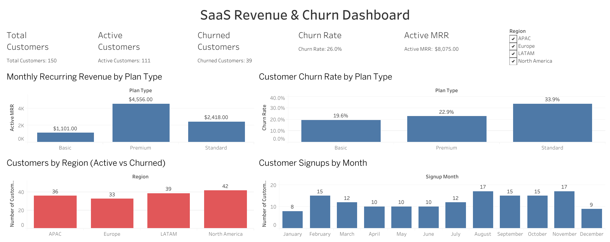

## SaaS Revenue & Churn Dashboard

This project analyzes SaaS subscription revenue and churn using:

  - Excel for designing and generating a simulated SaaS customer dataset
  - Tableau Public for an interactive revenue & churn dashboard
  - BA-style documentation (BRD + case study) for insights and business recommendations
    
The goal is to monitor subscription health (MRR, active customers, churn), understand which plans and regions drive performance, and translate those patterns into clear, actionable steps for a SaaS leadership team.

---

## 🎯 Business Question

A B2B SaaS provider wants to answer:

  - How many customers do we have, and how many are active vs churned?
  - How much Monthly Recurring Revenue (MRR) are we generating?
  - Which plans (Basic / Standard / Premium) contribute most to revenue and suffer the highest churn?
  - How is performance distributed across regions (APAC, Europe, LATAM, North America)?
  - What does signup seasonality look like, and when should marketing focus its efforts?

---

## 📂 Project Structure
~~~
saas-revenue-churn-dashboard/
├── data/
│   └── saas_customers.xlsx                   # Simulated SaaS customer-level dataset
├── docs/
│   ├── BRD_saas_revenue_churn_dashboard.md   # Business Requirements Document (BA-style)
│   └── case_study_saas_revenue_churn.md      # Narrative case study & recommendations
├── tableau/
│   └── saas_revenue_churn.twbx               # Tableau packaged workbook (dashboard)
└── README.md                                 # Project overview (this file)
~~~
---

## 📊 Data

Source
  - Custom, simulated dataset created in Excel to represent a mid-sized B2B SaaS business.
Unit of analysis
  - 1 row = 1 customer
Main feature groups
  - Customer profile
    - customer_id
    - signup_month (month of first subscription)
    - region – APAC, Europe, LATAM, North America
  - Subscription / plan
    - plan_type – Basic, Standard, Premium
    - monthly_fee – plan-specific MRR per customer
    - tenure_months – how long the customer has been with the company
    - churned_after_months – months until churn (for churned customers only)
  - Status & acquisition
    - status – Active / Churned
    - acquisition_channel – Ads, Organic, Referral, Partner

After creation / cleaning
  - Total customers: 150
  - Active customers: 111
  - Churned customers: 39
  - Overall churn rate: ≈ 26% (39 / 150)
  - Active MRR: ≈ $8,075

---

## 📈 Dashboard Design (tableau/saas_revenue_churn.twbx)

The Tableau workbook implements the KPIs and visual design described in the BRD.
KPIs (Top Banner)

  - Total Customers – distinct count of customer_id
  - Active Customers – distinct customers with status = "Active"
  - Churned Customers – distinct customers with status = "Churned"
  - Churn Rate – Churned / Total customers (point-in-time snapshot)
  - Active MRR – SUM(monthly_fee) for active customers

Visuals
* Monthly Recurring Revenue by Plan Type
  - Bar chart
  - X-axis: plan_type
  - Y-axis: SUM(Active MRR)
  - Shows contribution of Basic, Standard, Premium to total MRR
* Customer Churn Rate by Plan Type
  - Bar chart
  - X-axis: plan_type
  - Y-axis: churn rate (%) per plan
  - Highlights which plan has the weakest retention
* Customers by Region (Active vs Churned)
  - Stacked bar chart
  - X-axis: region
  - Y-axis: COUNTD(customer_id)
  - Color: status (Active / Churned)
  - Shows customer distribution and churn mix by region
* Customer Signups by Month
  - Vertical bar chart
  - X-axis: signup_month (Month)
  - Y-axis: distinct count of customers
  - Reveals seasonality in new customer acquisition

Filters & Interactivity
- Region filter (multi-select list)
  - Applies to all main charts to focus on one or more regions
- Clean tooltips that show:
  - Plan / Region / Month
  - Metric value (MRR, churn rate, # customers)

---

## 🖼️ Dashboard Preview

Below is a preview of the Tableau churn dashboard built from the scored dataset:

---

## 🔢 Headline Metrics & Patterns

- From the current snapshot:
  - Total customers: 150
  - Active: 111
  - Churned: 39
  - Churn rate: ≈ 26%
  - Active MRR: $8,075
- MRR by Plan Type
  - Basic: ~$1,101
  - Standard: ~$2,418
  - Premium: ~$4,556
- Churn Rate by Plan
  - Basic: ~19.6%
  - Premium: ~22.9%
  - Standard: ~33.9% (highest churn)
- Customers by Region
  - APAC: 36
  - Europe: 33
  - LATAM: 39
  - North America: 42
- Customer Signups by Month
- Peaks in February, August, November (15–17 new customers)
- Weakest in January and December

---

## 💡 Business Takeaways

From the dashboard and case-study analysis:
- Revenue is concentrated in Premium plans
  - Premium customers generate more than half of Active MRR (~$4.6k), even though they are not the majority of customers.
  - Protecting this segment is critical for revenue stability.
- Standard plan has the weakest retentio
  - Churn rate for Standard (~33.9%) is significantly higher than Basic and Premium.
  - This suggests misaligned pricing/positioning or product fit for Standard customers.
- Overall churn level is risk
  - A churn rate of ~26% implies that over a quarter of the customer base has left
  - Without retention efforts, long-term recurring revenue growth is at risk.
- Regions are balanced – good and bad news
  - Customer counts are fairly even across APAC, Europe, LATAM, and North America.
  - Performance changes in any one region (good or bad) will materially impact overall metrics.
- Seasonality can guide marketing
  - Higher signups in February, August, and November suggest natural demand peaks.
  - Campaigns can be timed to these months, while special offers or promotions can support weaker months like January and December.

A full narrative of these points and detailed recommendations is in:
📄 docs/case_study_saas_revenue_churn.md

---

## 🛠️ Tools & Skills Used

- Excel
  - Dataset design and generation
  - Randomized assignments for plan, region, status, and revenue
- Tableau Public
  - KPI calculations and level-of-detail aggregations
  - Interactive dashboard (filters, tooltips, stacked bars, KPI tiles)
- Business Analysis
  - BRD documenting problem, scope, KPIs, and dashboard requirements
  - Case study translating metrics into business-focused insights and actions
- Git & GitHub
  - Version control for the dataset, Tableau workbook, and documentation
  - Public repository for portfolio / recruiter sharing

--- 

## 🚀 How to View the Dashboard Locally

* Clone or download the repository
~~~
git clone https://github.com/<your-username>/saas-revenue-churn-dashboard.git
cd saas-revenue-churn-dashboard
~~~

* Open the Tableau workbook
  - Launch Tableau Public / Tableau Desktop.
  - Go to File → Open.
  - Navigate to tableau/saas_revenue_churn.twbx and open it.

* Explore
  - Use the Region filter to focus on specific geographies.
  - Hover over bars to see tooltips with exact values.
  - Use the KPI banner to get a quick health check of the subscription base.

(No Python environment is required for this project; it is fully Excel + Tableau + documentation.)

---

✍️ Author

Sai Siddesh Reddy Bynigeri

Business / Data Analyst – Excel, Tableau, Python, SQL
